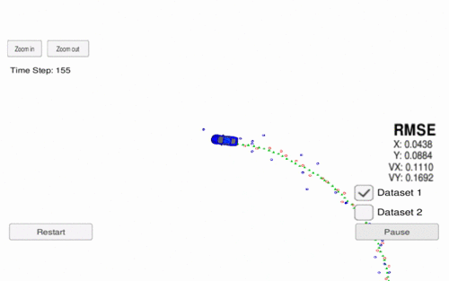

# Unscented Kalman Filter Project Finished Code
Self-Driving Car Engineer Nanodegree Program

In this project utilize an Unscented Kalman Filter to estimate the state of a moving object of interest with noisy lidar and radar measurements. Passing the project requires obtaining RMSE values that are lower that the tolerance outlined in the project rubric. 

This project involves the Term 2 Simulator which can be downloaded [here](https://github.com/udacity/self-driving-car-sim/releases)

# To build and run with Term 2 Simulator

* building and launching filter:
1. mkdir build
2. cd build
3. cmake ..
4. make
5. ./UnscentedKF

* testing filter with simulator:
run the Term 2 Simulator.

# Code Structure

__Class hierarchy__:
[`Lidar`](https://github.com/bo-rc/CarND-Unscented-Kalman-Filter-Project/blob/master/src/Lidar.h) and [`Radar`](https://github.com/bo-rc/CarND-Unscented-Kalman-Filter-Project/blob/master/src/Radar.h) are derived classes from [`Sensor`](https://github.com/bo-rc/CarND-Unscented-Kalman-Filter-Project/blob/master/src/Sensor.h), which is an abstract class providing common interface:
* [`enable()`/`disable()`](https://github.com/bo-rc/CarND-Unscented-Kalman-Filter-Project/blob/269dc65bf18131887c3d2b3457a4d78943aa3b1c/src/Sensor.h#L23): to make this sensor active or inactive.
* [`update_measurement()`](https://github.com/bo-rc/CarND-Unscented-Kalman-Filter-Project/blob/269dc65bf18131887c3d2b3457a4d78943aa3b1c/src/Sensor.h#L25): to receive a `MeasurementPackage` data and update the sensor's current measurement.
* [`update()`](https://github.com/bo-rc/CarND-Unscented-Kalman-Filter-Project/blob/269dc65bf18131887c3d2b3457a4d78943aa3b1c/src/Sensor.h#L26): to perform the update step for a UKF. (The predict step does not depend on sensor types so it is performed by UKF alone.)

[`UKF_fusion`](https://github.com/bo-rc/CarND-Unscented-Kalman-Filter-Project/blob/master/src/UKF_fusion.h) object keeps track of a list of available sensors, stored in a `std::vector<unique_ptr<Sensor>>`. UKF_fusion does the prediction step without sensors' involvement. The update step must be performed with sensors' knowledge, so UKF_fusion uses all sensors to update state vector `x` and the covriance matrix `P`.

This separation allows future addition of more sensors to UKF for sensor fusion.

# Noise parameters
In reality, sensor noise data may be obtained from its datasheet or testing. Here, [`parm.config`](./parm.config) defines the parameters. This file is read by the UKF unpon app start.

## Other Important Dependencies
* cmake >= 3.5
  * All OSes: [click here for installation instructions](https://cmake.org/install/)
* make >= 4.1 (Linux, Mac), 3.81 (Windows)
  * Linux: make is installed by default on most Linux distros
  * Mac: [install Xcode command line tools to get make](https://developer.apple.com/xcode/features/)
  * Windows: [Click here for installation instructions](http://gnuwin32.sourceforge.net/packages/make.htm)
* gcc/g++ >= 5.4
  * Linux: gcc / g++ is installed by default on most Linux distros
  * Mac: same deal as make - [install Xcode command line tools](https://developer.apple.com/xcode/features/)
  * Windows: recommend using [MinGW](http://www.mingw.org/)

